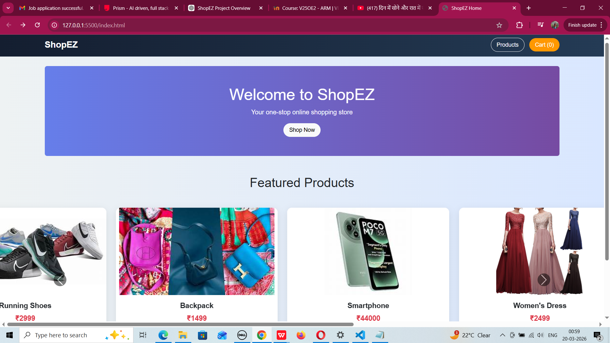
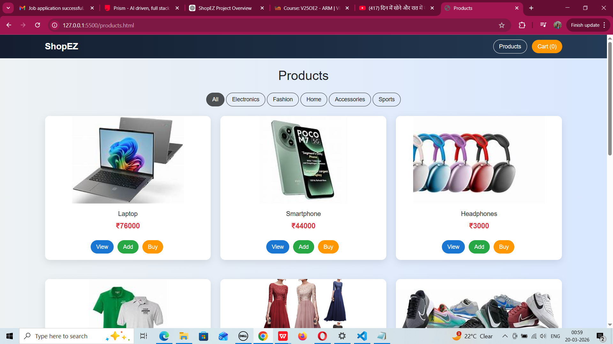
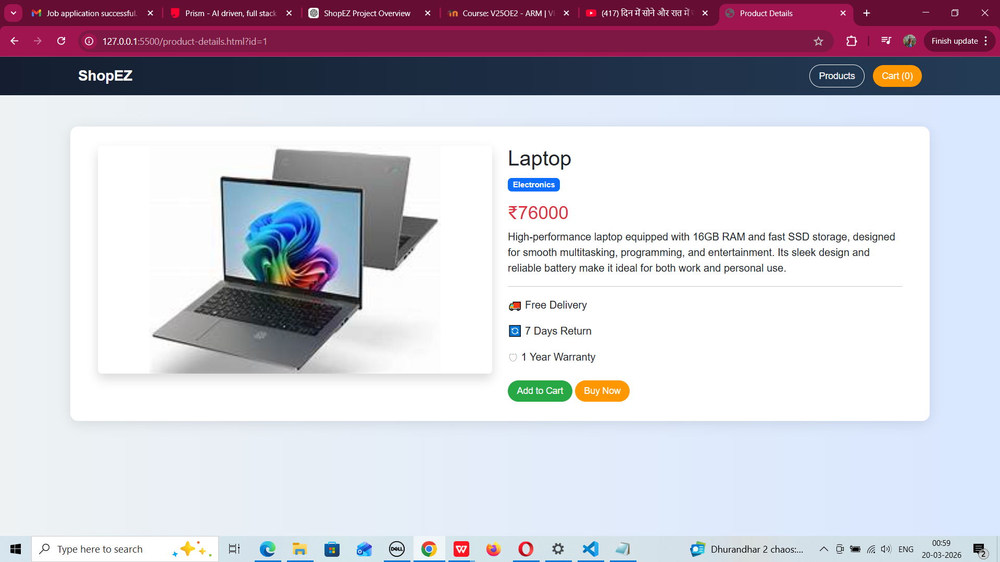
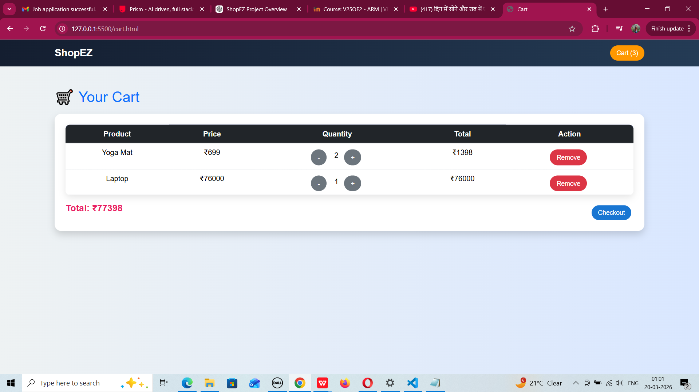
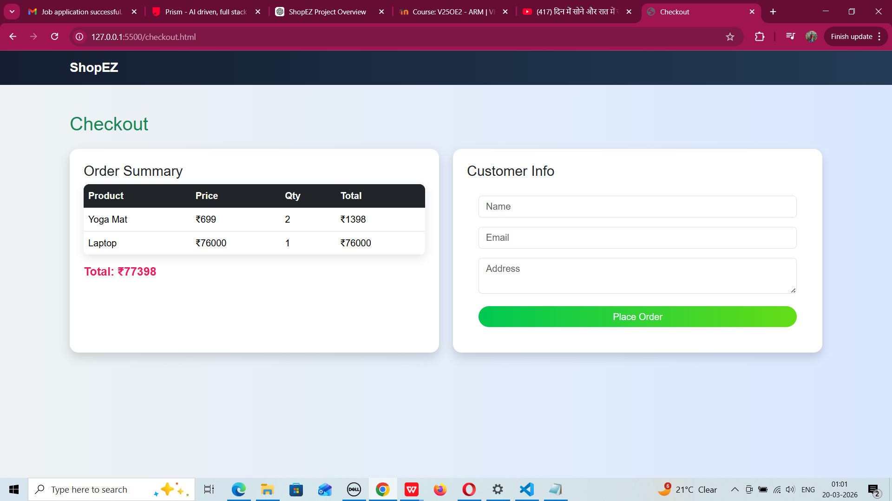

# 🛒 ShopEZ – E-Commerce Frontend Application

A simple and responsive frontend e-commerce web application built using HTML, CSS, JavaScript, Bootstrap, and jQuery.

---


---

## 📌 Project Overview

ShopEZ is a frontend e-commerce web application that allows users to browse products, view product details, add items to a shopping cart, and simulate a checkout process.

This project is built entirely using frontend technologies and stores data using LocalStorage.

---
---





## 🚀 Technologies Used

* HTML5
* CSS3
* JavaScript (ES6)
* Bootstrap 5
* jQuery
* LocalStorage
* JSON

---

## 🎯 Features

### 🛍️ Product Listing

* Displays products dynamically from JSON
* Shows image, name, and price
* Add to Cart and View Details options

### 📄 Product Details

* Displays detailed product information
* Add to cart functionality

### 🛒 Shopping Cart

* Add/remove products
* Increase/decrease quantity
* Auto total price calculation
* Data stored in LocalStorage

### 💳 Checkout

* User form (Name, Email, Address)
* Order summary display
* Simulated order placement

---

## 📂 Project Structure

```
ShopEZ-Frontend
│
├── index.html
├── products.html
├── product-details.html
├── cart.html
├── checkout.html
│
├── css
│   └── styles.css
│
├── js
│   ├── products.js
│   ├── cart.js
│   ├── checkout.js
│   └── common.js
│
├── data
│   └── products.json
│
├── images
│
└── lib
    ├── bootstrap
    └── jquery
```

---

## ⚙️ How to Run the Project

1. Download or clone the project
2. Open the folder in VS Code
3. Open `index.html` in your browser
4. Explore the application

---


## 📸 Screenshots

### 🏠 Home Page

---


### 🛍️ Products Page

---


### 📄 Product Details Page

---

### 🛒 Cart Page


---

### 💳 Checkout Page


---

## 🧪 Testing

* Product listing loads correctly
* Add to cart functionality works
* Remove item from cart works
* Quantity updates correctly
* Total price calculation is accurate
* Checkout form works properly

---

## 📌 Limitations

* No backend/database integration
* No real payment system
* No user authentication

---

## 🔮 Future Enhancements

* Add login and signup system
* Implement product filtering
* Add search functionality
* Integrate backend APIs

---

